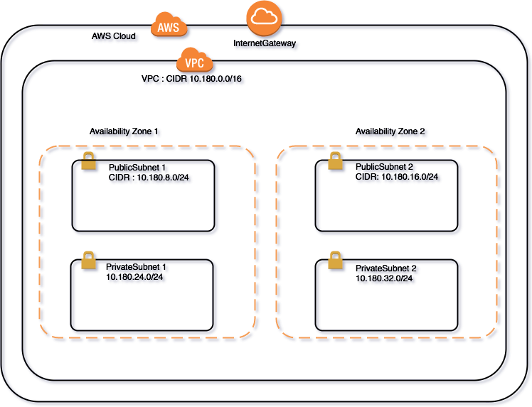

# Purpose
To familiar with Infrastructure as code, using AWS Cloudformation template to design a sample web application architecture.

Go through this lab, you will realize Cloudformation (a.k.a -> cfn) how to arrange resources, coordinate the resources component interaction, and associate them within few commands.

The Simple Web Application designed with: 

* VPC
* Security Group
* Application Load Balancer
* RDS-Mysql
* EC2 On-demand/Spot instances
* Simple System Manager - Parameter Store

# Key Concepts

Cloudfomration components design just like playing lego. If you want to construct a robustness basis architecture, then you do need to consider about draft it as blueprint. Incrementally add on and iteratively deploy, validate it.

# Pre-requistie

1. Take or Create an IAM User for Cloudformation instruction, ensure the IAM user was associated with enough policies to do.
2. Download or create Keypair named : **labuserkey** for the default cloudformation template resource instruction usage.
3. Create an IAM Role for EC2 instance usage, which should be associated with EC2 SSM Parameter Store policies at least.
4. A good text editor tool, such as VS core, Sublime text, Atom, ... etc.
5. PHP or other language programming skiils, should not to be expert. Just need to modify arguments as you need.

# Go Labs

## Step 0 Prepare development environment

Recommend to use Visual Studio Code or Atom IDE to design CFN, leverage useful plugin would help you to design it effectively.

### To adopt JSON or YAML in Cloudformation ?

Generally speaking, depends on your team. There are some criterias to help you make decision.

* Do you need comments in template ?
* Do you need to train or facilitate guys to get familiar with cfn?

In case of which 1 you need, recommend to use YAML.

Of course, you can also transfer the different format in 1 second, check this -> 
[Tool for converting AWS CloudFormation templates between JSON and YAML formats](https://github.com/awslabs/aws-cfn-template-flip)

### Visual Studio Code

[Visual Studio Code official Web Site ](https://code.visualstudio.com/)

[VS Code plugin for Cloudformation - JSON](https://marketplace.visualstudio.com/items?itemName=aws-scripting-guy.cform)

[VS Code plugin for Cloudfromation - YAML](https://marketplace.visualstudio.com/items?itemName=DanielThielking.aws-cloudformation-yaml)

### Atom

[Atom Official Web Site](https://atom.io/)

[Atom atom-cform-yaml package](https://atom.io/packages/atom-cform-yaml)

[Atom atom-cform package](https://atom.io/packages/atom-cform)

### Make Lab ready
1. Clone lab project

> git clone https://github.com/humank/20171116-cfn-lab.git

2. Create S3 Bucket to store Cloudformation Template for later usage.

> Recommend to practice this lab at Region Tokyo to have good user experience, create a s3 Bucket at Region Tokyo is good but not must .--> 需要補圖做說明

3. Generate or keep the IAM User Accesskey csv file, will leverage the Accesskey and AccessSecurityKey to SSH into EC2 instance for check status. 
--> 需要補圖做說明

click the button to launch the demo stack in *us-west-2*

check the cloudformation output and click the ***LoadBalancerURL*** link to see the result.

click the button to launch the demo stack in *Tokyo*

check the cloudformation output and click the ***LoadBalancerURL*** link to see the result.

click the button to launch the demo stack in *us-west-1*

check the cloudformation output and click the ***LoadBalancerURL*** link to see the result.

## Step 1 Create VPC template

Change directory to LAB_PROJECT_FOLDER/setp1.
Contains two files :

1. master.yml
2. vpc.yml

## Step 2 Create Security Groups template

## Step 3 Create Application Load Balancer template

## Step 4 Create EC2 On-demand/Spot instances within AutoScaling group template

## Step 5 Create RDS-MySql template

# References

# Useful Cloudformation Template tools recommendation

The training material is reference from awslab [startup-kit-templates](https://github.com/awslabs/startup-kit-templates) and [ecs-refarch-cloudformation](https://github.com/awslabs/ecs-refarch-cloudformation).

